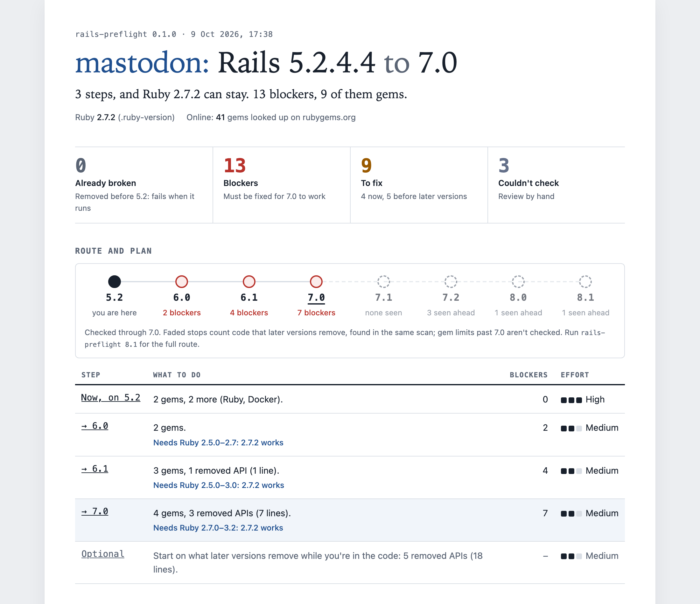
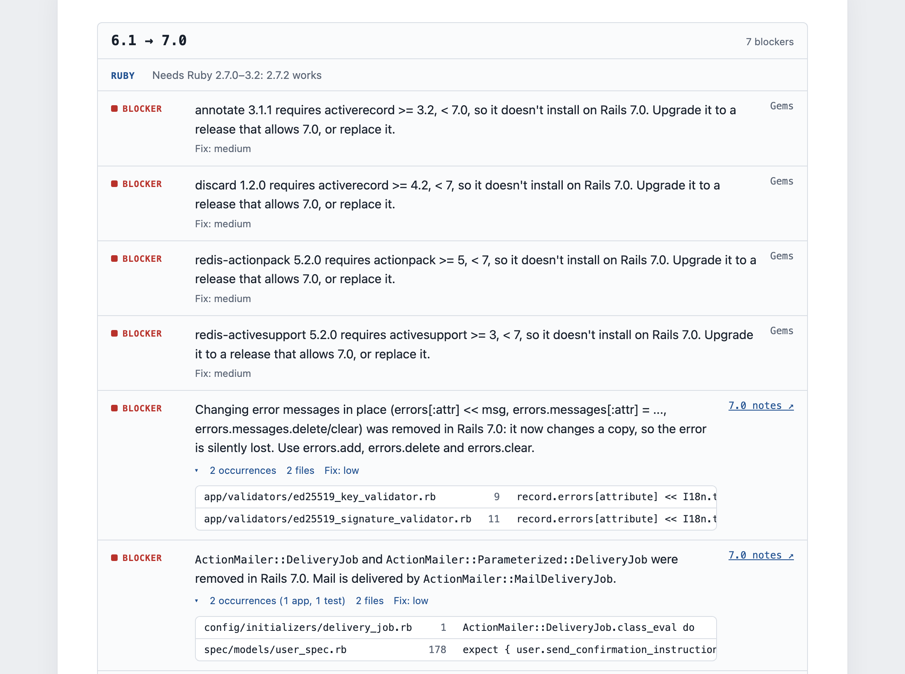

# RailsPreFlight 🛡️

**Assess Rails upgrade risk before you touch a single line of code.**

`rails-preflight` is a static analysis tool that scans legacy Rails applications and produces a **human-readable upgrade risk report**.

It helps teams understand:

- what will block a Rails upgrade
- what is easy vs painful to fix
- where hidden dependency and infrastructure risks exist

This tool is designed for **planning and scoping**, not automated migration.

<picture>
  <source media="(prefers-color-scheme: dark)" srcset="docs/images/report-overview-dark.png">
  
</picture>

<sub>Mastodon v3.3.0, an open-source app, checked for Rails 7.0.</sub>

## Why this exists

Rails upgrades fail not because teams can’t write code, but because they underestimate risk:

- private gems with unknown compatibility
- subtle framework deprecations
- Ruby and OS lifecycle mismatches
- Docker runtime issues that surface late

`rails-preflight` makes these risks visible before you start upgrading.

Think of it as **upgrade reconnaissance**, not a fixer. Run it before the upgrade starts, whoever does it: your team, a consultant or a coding agent.

## What this tool does

The audit analyzes your project for common Rails upgrade risk factors:

- Ruby & Rails compatibility, and which upgrade step to move Ruby on
- End-of-life Ruby and Node versions
- Private / internal gem dependencies
- Locked gems whose declared Rails requirement caps the upgrade, plus a curated list of gems with known limits
- Removed and deprecated Rails APIs in code, config YAML, rake tasks in scripts and CI, including ones already removed from your current Rails
- Docker runtime risks (EOL base image, locale, tzdata, OpenSSL mismatch)
- Database schema risks (charset, integer IDs)
- Missing or outdated `config.load_defaults`

The output is a **single HTML report** designed to be:

- readable by engineers
- understandable by EMs and tech leads
- usable in upgrade planning discussions

The same findings also come as **Markdown**, a checklist for issues, PRs and coding agents, and as **JSON** for CI and other tools. See [Output formats](#output-formats).

## What this tool intentionally does NOT do

- ❌ It does not modify your code
- ❌ It does not auto-fix deprecations
- ❌ It does not guarantee upgrade success
- ❌ It is not a replacement for running tests or CI

If you’re looking for a “one-click upgrade,” this is not that tool.

## Related tools

These cover what `rails-preflight` leaves out, and pair well with it:

- [next_rails](https://github.com/fastruby/next_rails) or [RailsBump](https://railsbump.org): which gem versions work with your target Rails
- [Brakeman](https://brakemanscanner.org): security issues
- [rubocop-rails](https://github.com/rubocop/rubocop-rails): autofixes for many deprecations

## Who this is for

This tool is especially useful if you are:

- Upgrading a Rails 5.0 or newer application (Rails 3 and 4 aren't covered)
- Planning a security-driven upgrade
- Scoping an upgrade before committing resources
- Auditing multiple legacy Rails apps
- A consultant or staff engineer responsible for upgrade strategy

## Installation

Install it globally and point it at your app. It only reads files, so the app can be on any Ruby version, including the old one your servers run. The machine running it needs Ruby 2.7 or newer.

```bash
gem install rails_preflight
rails-preflight /path/to/your/app
```

With no target, it reports on the next Rails minor after the app's (5.2 → 6.0, 7.1 → 7.2), the step Rails recommends taking next. Pass a target to plan a bigger jump: `rails-preflight 8.1 /path/to/your/app`. Leave out the path to audit the current directory.

Private gems come from `Gemfile.lock` and the Gemfile's `source` blocks, which are read, never run. Only when neither says where a gem comes from does the tool ask rubygems.org. It also asks rubygems.org when each public gem that depends on Rails last had a release, and lists the ones with nothing newer than the target Rails: nothing says they break, but nobody may have tried. Private gem names are never sent. Pass `--offline` for a fully static run; unplaced gems are then reported as unchecked, and release dates are skipped.

It knows Rails 5.0 to 8.1 (`database/compatibility.yml`); the default target is only as current as that list.

The tool will analyze:

- `Gemfile` and `Gemfile.lock`
- `.ruby-version`
- `Dockerfile` (if present)
- `db/schema.rb` (if present; an app on `db/structure.sql` gets a note that the schema checks were skipped)
- `config/application.rb` and `config/**/*.yml`
- `.rb`, `.erb`, `.haml`, `.slim` and `.rake` files under `app/`, `config/`, `db/`, `lib/`, `test/` and `spec/`
- Scripts and CI config (`bin/`, `script/`, Procfiles, Makefiles, CI workflows) for removed rake tasks

And generate:

```
rails_preflight_report.html
```

Or `rails_preflight_report.md` or `.json` with `--format markdown` or `--format json`: see [Output formats](#output-formats).

## Output formats

Every format renders the same findings. Each finding carries its parts, not only a sentence: the gem, its locked version and the requirement it fails, or the rule with every file, line and matched line, plus the release notes, README or Rails source it rests on.

| Format | Flag | Written to, in the app | For |
|---|---|---|---|
| HTML | (default) | `rails_preflight_report.html` | reading, planning, sharing |
| Markdown | `--format markdown` | `rails_preflight_report.md` | issues, PRs, coding agents |
| JSON | `--format json` | `rails_preflight_report.json` | CI and other tools |

The report is the only file the tool writes. Add `--stdout` to print it instead, for pipes and coding agents: no file is written, and progress goes to stderr so stdout holds only the report. Every run also prints a short summary (counts, then each blocker) for SSH sessions and CI logs.

### HTML

One self-contained file. It makes no network requests when opened, follows the OS dark mode, and prints on A4.

1.  **Title and verdict**: `app: Rails current to target`, then one sentence: how many steps, when to upgrade Ruby, how many blockers.

2.  **Counts**, each linked to where the findings are:
    *   **Already broken**: APIs removed before your current Rails, or gems past their last supported Rails. That code fails when it runs, or never runs.
    *   **Blockers**: must be fixed before the upgrade can work (e.g. Ruby too old, removed APIs still in use).
    *   **To fix**: will warn or break along the way (deprecations, lagging config), split into now and later versions.
    *   **Couldn't check**: what the tool could not verify (private gems, missing files), to review by hand.

3.  **Route and plan**: one stop per Rails minor, since Rails recommends upgrading one at a time, with the blockers at each. Later versions past the target are faded and count the code they remove, found in the same scan. A table gives each step's work, the Ruby it needs and a relative effort: the hardest single fix in it (low, medium or high, set per check), not the amount of work. The occurrence counts on each finding show that.

4.  **Steps**: "Before you start" for findings that don't belong to a step, then one card per step with its Ruby range and the removed APIs and gems to fix for it. Each finding links to the Rails release notes or the gem's source; its occurrence line expands to file, line and snippet, with app and test occurrences counted apart.

5.  **Ahead of the target**: code that later Rails versions remove, by version. Not needed now.

6.  **What this report can't see**: private gems and quiet gems by name, behavior changes, multi-line code and test coverage, with what to do instead.

7.  **Footer**: the confidence of each section (read from project files, pattern matches, or a key input missing) and where the findings come from.

<picture>
  <source media="(prefers-color-scheme: dark)" srcset="docs/images/report-step-dark.png">
  
</picture>

### Markdown

`--format markdown` writes `rails_preflight_report.md` into the app. A coding agent can read it from stdout instead:

```bash
rails-preflight --format markdown --stdout 7.2 /path/to/your/app
```

It's a checklist per step, with `file:line` and the matched line under each finding. It pastes into an issue or PR as is, and opens with a note telling a coding agent to take one step at a time, run the tests after each, and leave "Ahead" and "Couldn't check" alone. From the same Mastodon run:

```markdown
## Step 3: 6.1 to 7.0

Needs Ruby 2.7.0–3.2: 2.7.2 works.

- [ ] **Blocker:** annotate 3.1.1 requires activerecord >= 3.2, < 7.0, so it doesn't install on Rails 7.0. Upgrade it to a release that allows 7.0, or replace it.
- [ ] **Blocker:** `ActionMailer::DeliveryJob` and `ActionMailer::Parameterized::DeliveryJob` were removed in Rails 7.0. Mail is delivered by `ActionMailer::MailDeliveryJob`. ([source](https://guides.rubyonrails.org/7_0_release_notes.html#action-mailer-removals))
  - `config/initializers/delivery_job.rb:1` `ActionMailer::DeliveryJob.class_eval do`
  - `spec/models/user_spec.rb:178` `expect { user.send_confirmation_instructions }.to have_enqueued_job(ActionMailer::DeliveryJob)`
```

### JSON

`--format json` writes `rails_preflight_report.json` into the app, for CI and other tools. With `--stdout` it can be piped:

```bash
rails-preflight --format json --stdout 7.2 /path/to/your/app | jq '.counts'
```

The top level holds `schema`, `tool`, `app`, `current_rails`, `target_rails`, `ruby`, `offline`, `verdict` and `counts`, then the findings in `before` (before the first step), `steps` (each with `from`, `version`, its Ruby note and `findings`), `ahead` (keyed by the Rails version that removes them) and `cant_see`. There's no timestamp, so the same app gives the same output. Schema 1 may still change before 1.0; the number goes up when it does. A step from the same run, shortened:

```json
{
  "from": "6.1",
  "version": "7.0",
  "findings": [
    {
      "section": "Gem Compatibility",
      "kind": "blocker",
      "message": "annotate 3.1.1 requires activerecord >= 3.2, < 7.0, so it doesn't install on Rails 7.0. ...",
      "removed_in": "7.0",
      "fix_effort": "medium",
      "gem": "annotate",
      "version": "3.1.1",
      "requires": "activerecord >= 3.2, < 7.0"
    },
    {
      "section": "Deprecation Warnings",
      "kind": "blocker",
      "message": "'ActiveModel::Errors#keys', '#values', '#to_h', '#slice!' and '#to_xml' were removed in Rails 7.0. ...",
      "rule": "errors_hash_methods",
      "removed_in": "7.0",
      "fix_effort": "low",
      "confidence": "medium",
      "source": "https://guides.rubyonrails.org/7_0_release_notes.html#active-model-removals",
      "files": [
        { "file": "lib/mastodon/accounts_cli.rb", "line": 106, "snippet": "user.errors.to_h.each do |key, error|", "test": false }
      ]
    }
  ]
}
```

`kind` is `broken`, `blocker`, `to_fix`, `tip` or `unknown`. A finding has only the parts that apply to it: gem findings have `gem`, `version` and `requires`; code findings have `rule`, `confidence` and `files`; what the report couldn't check has `names`.

### Gating CI

`--fail-on blockers` exits 1 when anything blocks the upgrade or is already broken; `--fail-on broken` only when something is already broken. It works with any format. In CI, `--offline` keeps the run fully static:

```bash
rails-preflight --offline --format json --fail-on blockers 7.2
```

## Roadmap

For a detailed list of current features and future plans, please see [ROADMAP.md](ROADMAP.md).

## Philosophy

This tool favors:

- clarity over completeness
- honesty over false confidence
- planning support over automation

If it helps you avoid one failed upgrade attempt, it has done its job.

## Development

```bash
bundle install
bundle exec rake
```

CI runs the suite on every Ruby from 2.7 to 4.0.

## License

MIT
